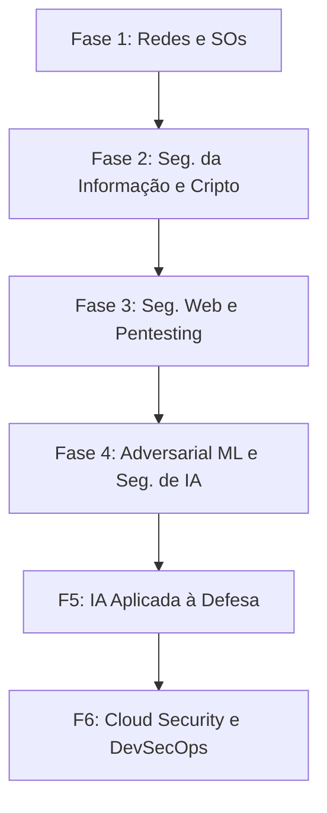

# Plano de Estudos: De IA (Deep Learning) para Cyber Security

Este plano foi desenvolvido especialmente para você que já possui domínio em **Inteligência Artificial (TensorFlow, PyTorch, NumPy, Python)** e deseja migrar ou expandir sua atuação para a área de **Cyber Security (Cibersegurança)**. 

Ter conhecimento profundo de redes neurais e manipulação de dados é um grande diferencial competitivo hoje. O mercado exige cada vez mais especialistas em segurança que saibam defender e atacar sistemas de IA, além de automatizar defesas corporativas usando modelos preditivos.

---

## 🎯 O Seu Diferencial: A Interseção entre IA e Cibersegurança

Seu background em matemática (álgebra linear, cálculo, estatística), programação robusta (Python) e frameworks de aprendizado profundo (PyTorch, TensorFlow) acelera seu aprendizado em tópicos complexos, como:
1. **Criptografia:** Compreensão intuitiva de algoritmos matemáticos complexos.
2. **Adversarial Machine Learning (ML Adversário):** Ataques que enganam redes neurais (ex: perturbações imperceptíveis em imagens ou textos).
3. **Segurança de LLMs (Large Language Models):** Prompt injection, vazamento de dados de treino e alinhamento de segurança.
4. **Inteligência de Ameaças baseada em IA:** Criação de detectores de malware e intrusão (IDS/IPS) usando modelos sequenciais (LSTMs, Transformers) ou grafos (GNNs).

---

## 🗺️ Roteiro de Estudos (Dividido em 6 Fases)

---

### 🌐 Fase 1: Fundamentos de Redes e Sistemas Operacionais
Antes de proteger ou atacar sistemas, você precisa entender como eles conversam e operam. Como você já programa em Python, esta fase focará na infraestrutura sob os dados.

*   **Redes de Computadores:**
    *   Modelo OSI e TCP/IP (entender detalhadamente as camadas).
    *   Protocolos essenciais: DNS, HTTP/HTTPS, TCP, UDP, ARP, ICMP, DHCP.
    *   Análise de tráfego de rede com **Wireshark** (capturar pacotes, ler headers).
*   **Sistemas Operacionais:**
    *   **Linux (Essencial):** Gerenciamento de processos, permissões de arquivo (chmod/chown), SSH, bash scripting (automação), e estrutura de diretórios (`/etc`, `/var`, `/bin`).
    *   **Windows Internals:** Active Directory (AD), processos, serviços, registro do Windows.
*   **Arquitetura e Memória (Opcional, para baixo nível):**
    *   Noções de Assembly (x86/x64) e linguagem C.
    *   Como a memória funciona: Stack vs. Heap, Buffer Overflows (introdução conceitual).

---

### 🔐 Fase 2: Segurança da Informação e Criptografia
Aqui seu background matemático ajuda muito. Você aprenderá como dados são protegidos em trânsito e em repouso.

*   **Conceitos Básicos:**
    *   Tríade CIA (Confidencialidade, Integridade, Disponibilidade).
    *   Gerenciamento de Identidade e Acesso (IAM), Autenticação vs. Autorização.
*   **Criptografia na Prática:**
    *   **Criptografia Simétrica:** AES, DES (foco no funcionamento do AES e modos de operação como CBC/GCM).
    *   **Criptografia Assimétrica:** RSA, Curvas Elípticas (ECC) - conceitos de chaves públicas/privadas.
    *   **Funções de Hash:** SHA-256, MD5, bcrypt, HMAC (essencial para integridade e armazenamento de senhas).
    *   **Protocolos de Segurança:** SSL/TLS (handshake), certificados digitais (PKI), SSH, PGP.

---

### 🕸️ Fase 3: Segurança Web e Pentesting Tradicional (Segurança Ofensiva)
Aprender a mentalidade de um atacante para entender como defender.

*   **Segurança Web (OWASP Top 10):**
    *   **SQL Injection (SQLi):** Manipulação de queries de banco de dados.
    *   **Cross-Site Scripting (XSS):** Injeção de scripts maliciosos que rodam no browser da vítima.
    *   **Broken Authentication & Session Management:** Roubo de tokens, cookies e bypass de login.
    *   **CSRF (Cross-Site Request Forgery) e SSRF (Server-Side Request Forgery).**
*   **Metodologia de Pentesting:**
    *   Reconhecimento (Recon) passivo e ativo: `nmap`, `subfinder`, `whois`.
    *   Varredura e Exploração: Utilização do **Metasploit Framework**.
    *   Interceptação de tráfego web: Uso do **Burp Suite** ou **OWASP ZAP** para analisar e modificar requisições HTTP.
*   **Segurança de APIs:** Rest APIs, GraphQL, injeções em payloads JSON.

---

### 🧠 Fase 4: Adversarial Machine Learning e Segurança de Modelos (Seu Diferencial ⭐)
*Esta é a fase em que seu conhecimento prévio vira uma arma poderosa. Foca em como atacar e defender pipelines de Machine Learning.*

*   **Ataques de Evasão (Adversarial Attacks):**
    *   Como perturbar inputs matematicamente para enganar redes neurais profundas.
    *   Algoritmos principais:
        *   **FGSM** (Fast Gradient Sign Method) - usando o gradiente do modelo para gerar ruído.
        *   **PGD** (Projected Gradient Descent) - ataque iterativo mais robusto.
        *   **Carlini & Wagner (C&W)**.
    *   *Ferramentas:* **Adversarial Robustness Toolbox (ART)** da IBM, **CleverHans** (PyTorch/TensorFlow).
*   **Ataques de Envenenamento de Dados (Data Poisoning):**
    *   Inserção de dados maliciosos no conjunto de treino para criar "backdoors" no modelo (ex: fazer um detector de malware ignorar um tipo específico de arquivo).
*   **Ataques de Privacidade e Extração:**
    *   **Membership Inference Attacks:** Determinar se um registro específico foi usado no treino do modelo (crítico para LGPD/GDPR).
    *   **Model Inversion:** Reconstruir dados de treinamento a partir das predições do modelo.
    *   **Model Stealing / Extraction:** Duplicar a funcionalidade de um modelo proprietário fazendo queries sistemáticas à sua API.
*   **Segurança de Large Language Models (LLMs):**
    *   **OWASP Top 10 for LLMs:** Prompt Injection (indireta e direta), Insecure Output Handling, Training Data Poisoning, Sensitive Information Disclosure.
    *   **Jailbreaking:** Técnicas para fazer o LLM ignorar diretrizes de segurança (system prompts).
    *   **Defesas:** Guardrails (NeMo Guardrails, Llama Guard), alinhamento via RLHF/DPO.

---

### 🛡️ Fase 5: IA Aplicada à Defesa (Defensive AI / Blue Teaming)
*Aprenda a construir sistemas de defesa inteligentes utilizando seus conhecimentos de ciência de dados.*

*   **Detecção de Intrusão e Anomalias (NIDS/HIDS):**
    *   Desenvolver modelos de detecção de anomalias com **scikit-learn** (Isolation Forests, One-Class SVM) ou Autoencoders em PyTorch para identificar tráfego de rede suspeito.
*   **Análise de Logs em Larga Escala:**
    *   Processamento de linguagem natural (NLP) e Transformers (BERT) para analisar logs do sistema operacional ou de servidores web em tempo real e classificar eventos de segurança.
*   **Classificação de Malware:**
    *   Extração de features de arquivos binários (PE/ELF), chamadas de API do sistema operacional, e treinamento de redes neurais convolucionais (CNNs) ou recorrentes (LSTMs) para identificar malwares conhecidos e variantes de dia zero (*zero-day*).
    *   Uso de Graph Neural Networks (GNNs) para analisar grafos de chamadas de controle (CFG) de malwares.
*   **Combate a Deepfakes:**
    *   Modelos de visão computacional voltados à detecção de manipulação de mídia (imagens e vídeos gerados por GANs ou modelos de difusão).

---

### ☁️ Fase 6: Cloud Security, DevSecOps e Tendências de Mercado
Tópicos de infraestrutura moderna muito valorizados no mercado corporativo atual.

*   **Segurança em Nuvem (Cloud Security):**
    *   Conceitos de segurança em AWS, GCP ou Azure (IAM de nuvem, VPCs, Security Groups).
    *   Segurança de Containers: **Docker** (boas práticas de imagem) e **Kubernetes (K8s)** (Network Policies, RBAC).
*   **DevSecOps:**
    *   Integração de testes de segurança na esteira CI/CD (GitHub Actions, GitLab CI).
    *   **SAST** (Static Application Security Testing) e **DAST** (Dynamic Application Security Testing).
    *   **SCA** (Software Composition Analysis) - analisar dependências vulneráveis em projetos de código.
*   **Arquitetura Zero Trust (Confiança Zero):**
    *   Princípio de "nunca confiar, sempre verificar". microssegmentação de rede e autenticação contínua.

---

## 🛠️ Plataformas Práticas Recomendadas

Para consolidar a teoria com a prática:

1.  **Cibersegurança Geral / Ofensiva:**
    *   [TryHackMe](https://tryhackme.com/) (Excelente para iniciantes, com caminhos de aprendizado guiados sobre Linux, Redes e Pentest).
    *   [Hack The Box](https://www.hackthebox.com/) (Mais avançado, laboratórios de invasão de máquinas reais).
    *   [PortSwigger Web Security Academy](https://portswigger.net/web-security) (A melhor plataforma gratuita do mundo para aprender Segurança Web / OWASP Top 10).
2.  **Segurança de IA e Adversarial ML:**
    *   [Crucible by Bifrost](https://crucible.dreadnode.io/) (Plataforma estilo Capture The Flag - CTF focada exclusivamente em hackear modelos de ML e LLMs).
    *   [TensorFlow/PyTorch Tutorials on Adversarial Attacks](https://pytorch.org/tutorials/beginner/fgsm_tutorial.html) (Tutorial oficial do PyTorch sobre FGSM).
3.  **Segurança de Código e DevSecOps:**
    *   [Snyk Interactive Tutorials](https://snyk.io/) (Tutoriais práticos de segurança de dependências e código).

---

## 🎓 Certificações Relevantes no Mercado

Se o seu objetivo for empregabilidade rápida ou consultoria corporativa, considere estas certificações ao longo do caminho:

### 1. Fundamentos e Intermediárias (Ideais para iniciar)
*   **CompTIA Security+:** Padrão ouro global para validar conhecimentos básicos de segurança (redes, ameaças, governança).
*   **EJPT (eLearnSecurity Junior Penetration Tester):** Excelente certificação 100% prática de segurança ofensiva para iniciantes.

### 2. Avançadas e Ofensivas
*   **OSCP (Offensive Security Certified Professional):** Uma das certificações de pentest mais respeitadas do mercado mundial (exame totalmente prático de 24 horas).

### 3. Focadas em Nuvem e Engenharia
*   **AWS Certified Security - Specialty** ou **Google Cloud Professional Cloud Security Engineer** (Altamente valorizadas devido à migração massiva de IA para a nuvem).

### 4. Segurança de IA (Área emergente)
*   Ainda não há uma certificação dominante clássica apenas para "AI Security", mas especializações e cursos da **Dreadnode**, **AIShield** e da própria **Linux Foundation** (como *AI Safety and Security*) estão ganhando muita força no mercado de ponta.

---

## 📈 Plano de Ação Sugerido (Timeline Estimada)

| Período | Foco Principal | Projetos / Prática Sugeridos |
| :--- | :--- | :--- |
| **Mês 1** | Fundamentos de Redes e Linux | Configurar laboratório no VirtualBox/Docker; analisar pacotes HTTP/DNS no Wireshark. |
| **Mês 2** | Criptografia e Segurança Web | Resolver desafios básicos de OWASP Top 10 no PortSwigger Academy. |
| **Mês 3** | Pentesting e APIs | Concluir o caminho "Jr Penetration Tester" no TryHackMe. |
| **Mês 4** | **Adversarial ML & LLM Sec** | Criar um script em PyTorch que realiza um ataque FGSM/PGD contra uma ResNet treinada por você. Explorar a biblioteca IBM ART. |
| **Mês 5** | **Defensive AI** | Desenvolver um classificador de tráfego de rede anômalo (ex: dataset NSL-KDD) usando PyTorch Autoencoders ou scikit-learn. |
| **Mês 6** | Cloud & DevSecOps | Subir uma aplicação em um container Docker na nuvem (AWS/GCP) e configurar uma pipeline CI/CD com scan de vulnerabilidades. |

---

## 📚 Referências Bibliográficas Recomendadas

Para aprofundar seus estudos teóricos e práticos, aqui estão alguns dos livros e artigos acadêmicos mais conceituados e atuais na área de cibersegurança tradicional e segurança de inteligência artificial.

### 1. Cibersegurança Tradicional, Redes e Sistemas
*   **"Redes de Computadores"** – Andrew S. Tanenbaum & David J. Wetherall. (O clássico absoluto para entender a base de como a internet funciona).
*   **"Segurança de Computadores: Princípios e Práticas"** – William Stallings & Lawrie Brown. (Excelente visão geral sobre criptografia, segurança de sistemas e redes).
*   **"The Web Application Hacker's Handbook: Finding and Exploiting Security Flaws"** – Dafydd Stuttard & Marcus Pinto. (Bíblia da segurança de aplicações web).
*   **"Hacking: The Art of Exploitation"** – Jon Erickson. (Excelente para entender engenharia reversa, buffer overflows e baixo nível).

### 2. Criptografia
*   **"Criptografia e Segurança de Redes"** – William Stallings. (Foco matemático e prático muito forte nos algoritmos AES, RSA, ECC e protocolos).
*   **"Serious Cryptography: A Practical Introduction to Modern Encryption"** – Jean-Philippe Aumasson. (Uma introdução moderna, prática e direto ao ponto).

### 3. Adversarial Machine Learning & Segurança de IA (Livros e Artigos)
*   **"Adversarial Machine Learning"** – Anthony D. Joseph, Blaine Nelson, Benjamin I. P. Rubinstein, J. D. Tygar. (Livro excelente sobre as bases teóricas de ataques a modelos de ML).
*   **Artigo Seminal (FGSM):** *"Explaining and Harnessing Adversarial Examples"* (2014) – Ian J. Goodfellow, Jonathon Shlens, Christian Szegedy. (O artigo que popularizou os exemplos adversários e o ataque FGSM).
    *   [Link no arXiv](https://arxiv.org/abs/1412.6572)
*   **Artigo PGD:** *"Towards Deep Learning Models Resistant to Adversarial Attacks"* (2017) – Aleksander Madry, Aleksandr Makelov, Ludwig Schmidt, Dimitris Tsipras, Adrian Vladu. (Introdução do PGD e do treinamento adversário robusto).
    *   [Link no arXiv](https://arxiv.org/abs/1706.06083)
*   **Artigo Carlini & Wagner:** *"Towards Evaluating the Robustness of Neural Networks"* (2017) – Nicholas Carlini, David Wagner. (Demonstra como quebrar as defesas mais comuns da época).
    *   [Link no arXiv](https://arxiv.org/abs/1608.04644)
*   **Model Poisoning:** *"Poison Frogs! Targeted Clean-Label Poisoning Attacks on Neural Networks"* (2018) – Ali Shafahi, W. Ronny Huang, Mahyar Najibi, Octavian Suciu, Christoph Studer, Tudor Dumitras, Tom Goldstein.
    *   [Link no arXiv](https://arxiv.org/abs/1804.00792)

### 4. Segurança de LLMs (Large Language Models)
*   **Artigo de Jailbreaking:** *"Universal and Transferable Adversarial Attacks on Aligned Language Models"* (2023) – Andy Zou, Zifan Wang, J. Zico Kolter, Matt Fredrikson. (Mostra como gerar sufixos adversários automáticos para induzir LLMs a responder conteúdos proibidos).
    *   [Link no arXiv](https://arxiv.org/abs/2307.15043)
*   **OWASP Document:** *"OWASP Top 10 for Large Language Model Applications"* – OWASP Foundation. (Guia prático indispensável atualizado frequentemente sobre os principais riscos de segurança de LLMs).
    *   [Link oficial do OWASP](https://owasp.org/www-project-top-10-for-large-language-model-applications/)

---

*“A cibersegurança não é apenas sobre quebrar sistemas; é sobre entender como os sistemas funcionam tão profundamente que você consegue prever onde eles falharão.”* Bons estudos!
